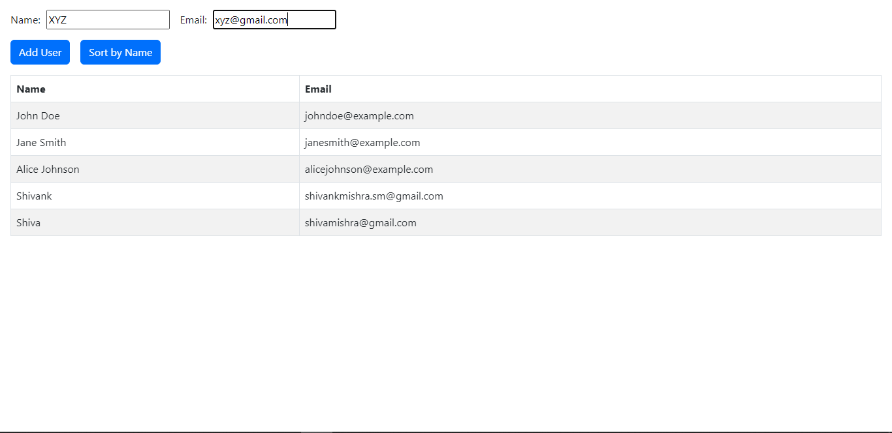
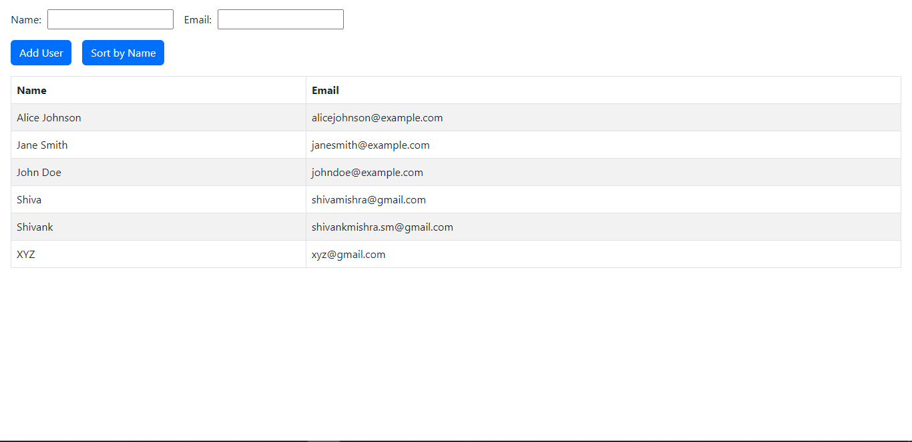

TO run this project -- Just type -" npm start "  in the terminal. Project will run.

Task
**Level 1 Question:**

Create an Angular component called `UserList` that displays a list of users. The component should have an input property called `users` that accepts an array of user objects, each containing `name` and `email` properties. The `UserList` component should display the list of users in a table with two columns: `Name` and `Email`.

Additionally, implement a button labeled "Sort by Name" above the table. When clicked, it should sort the list of users by their names in ascending order.

Write the necessary Angular code to implement the `UserList` component along with any additional code required to fulfill the requirements.

**Expected Output:**

Upon completion of the assignment, the `UserList` component should be able to receive an array of user objects through the `users` input property and display them in a table with two columns: `Name` and `Email`. Clicking the "Sort by Name" button should sort the list of users by their names in ascending order.

Example user data:
users = [
{ name: 'John Doe', email: 'johndoe@example.com' },
{ name: 'Jane Smith', email: 'janesmith@example.com' },
{ name: 'Alice Johnson', email: 'alicejohnson@example.com' },
// ...
];

Table displayed in the `UserList` component:

| Name          | Email                  |
|---------------|------------------------|
| Alice Johnson | alicejohnson@example.com|
| Jane Smith    | janesmith@example.com   |
| John Doe      | johndoe@example.com     |
| ...           | ...                    |

Clicking the "Sort by Name" button:

| Name          | Email                  |
|---------------|------------------------|
| Alice Johnson | alicejohnson@example.com|
| Jane Smith    | janesmith@example.com   |
| John Doe      | johndoe@example.com     |
| ...           | ...                    |        

**Implemented the requirement - with an additional functionality of adding new users.**

**LEVEL 1 -OUTPUT-**
Users List -  

Sorted User list - 

**Level 2 Question:** - No backend speciality, I applied for FrontEnd, 
thus I am not able to implement this currently as I don't have proper Backend Implementation Knowledge. 
